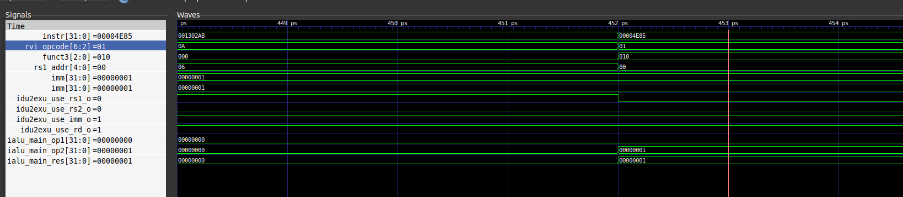

# Лабораторная Lab3 SCR1 RTL

## Задание

|Вариант|Инструкция                                |Описание                            |
|---|------------------------------------------|----------------------------------- |
|4|	Add immediate unsigned (ADDIU) |ADDIU: Беззнаковое сложение RS1 и константы 12-bit, результат поместить в RD| 

## Выполнение

### Добавление кастомной инструкции

1. ADDIU идейно максимально схожа ADDI, поэтому изначально хотелось бы поместить ее где-нибудь рядом, но там все плотно забито, поэтому возьмем свобоный опкод 7b'1101010.  (Тип команды I-type)
2. Добавим в *[scr1_riscv_isa_decoding.svh](../src/includes/scr1_riscv_isa_decoding.svh)* наш опкод

3.  На самом деле нам нужно сделать все тоже самое, что и для выполнения ADDI только во второй оперенд передать константу без расширения знака, поэтому добавим в декодер нужный блок кода, который формируем необходимые управляющие сигналы

    ```
         SCR1_OPCODE_OP_UIMM          : begin
                        idu2exu_use_rs1_o         = 1'b1;
                        idu2exu_use_rd_o          = 1'b1;
                        idu2exu_use_imm_o         = 1'b1;
                        idu2exu_cmd_o.imm         = {20'b0, instr[31:20]}; // старшие 20 битов равны 0, а в младшие 12 передаем imm
                        idu2exu_cmd_o.ialu_op     = SCR1_IALU_OP_REG_IMM;
                        idu2exu_cmd_o.rd_wb_sel   = SCR1_RD_WB_IALU;
                        case (funct3)
                            3'b000  : idu2exu_cmd_o.ialu_cmd  = SCR1_IALU_CMD_ADD;        // ADDIU
                        endcase // funct3
    ```


### Верификация

1. Создадим отдельную директорию custom_instruction для тестирования. Добавим туда тест и необходимые файлы. Также добавим в Makefile новый Target для тестирования 
2. |Тест|Инструкция |  значение res1  |значение imm |  значение rd                        |
   |---|-----------------|------| ---| ----| 
   |1|	0x1302AB| 0x0 | 0x1| 0x1 |
   |2|	0x302AB| 0x0 | 0x0 | 0x0 |
   |3|	0x302AB| 0x1 | 0x0| 0x1 |
   |4|	0x1302AB| 0x1 | 0x1| 0x2 |
   |5|	0xFFF302AB| 0x0 | 0xFFF| 0xFFF |
   |6|	0x800302AB| 0x1 | 0x800| 0x801 |
   |7|	0x800302AB| 0xFFFFF000 | 0x800| 0xFFFFF800 |
   |8|	0x1302AB| 0xFFFFFFFF | 0x1| 0x0 |
   |9|	0xFFF302AB| 0xFFFFFFFF | 0xFFF| 0x00000ffe|
Набор тестов проверяет корректность передачи результатов(знак константы не расширяется) и корректность сложения



На скриншоте видно, что значение всех сигналов верны (rvi_opcode=0A и тд) 
## Результаты

Из набора файлов в result можно сделать вывод, что все сигналы выставляются верно и инструкция корректо работает
## Вывод

Писать на SystemVerilog оказалось очень интересно)
